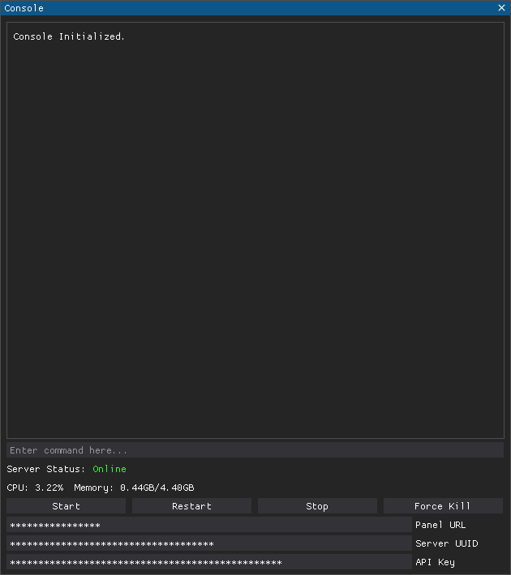

# PterodactylConsole
A script to connect to the server console using Pterodactyl API.

## Requirements
- Python 3.x
- websocket-client (install using `pip install websocket-client`)
- requests (install using `pip install requests`)
- dearpygui (install using `pip install dearpygui`)

## Usage
1. Run the `Main.py` script.
2. Provide the credentials on the bottom of the window.

## How Does It Work?
This tool connects to the Pterodactyl websocket and outputs every log that gets sent to the websocket and shows them on the console. This tool also allows you to stop, start or restart the server.
